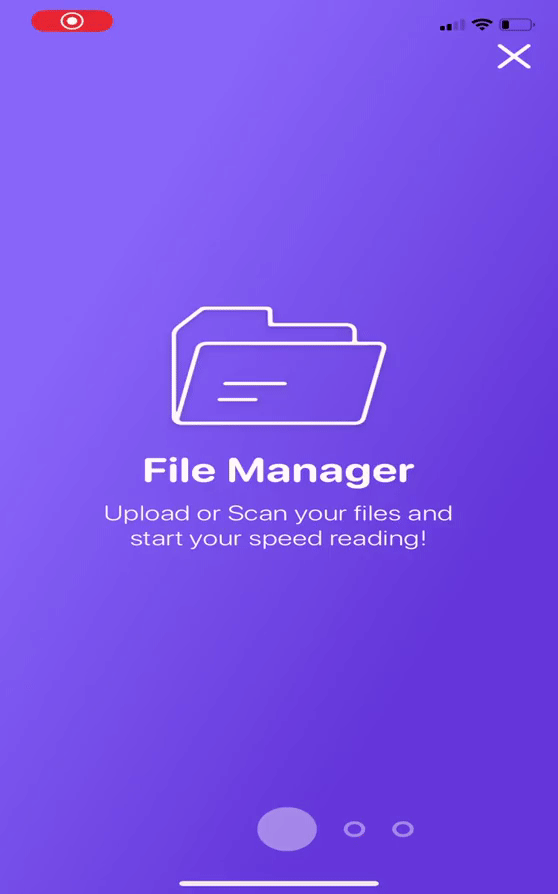

# Remo
An app that helps people who learnt speed reading techniques having the tools they need on the smartphone

# Getting started
Import a pdf, take a photo or read an image from the gallery in the "Reading Desk" section.

In "Exercise" you can instead improve your skills and become the best.

Do not miss any reading with the "file" section: a data archive always at your fingertips

Thanks to OCR technology you can scan anything you need to read as fast as possible, easy isn't it?
